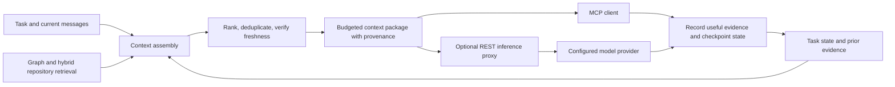

# Context platform direction — October 3, 2026

Platform name: **FIRE — Find, Integrate, Retrieve, Explain**. The accepted
[FIRE direction and compaction acceptance scenarios](fire-platform.md) make
recoverable evidence and task continuity across compression explicit requirements.

Product direction: **rest_proxy gives coding agents persistent, retrievable context
and assembles the relevant evidence into a bounded model request.** Native embedded
storage is the preferred distribution; Docker is optional packaging. The same
context service supports MCP clients and an optional REST inference proxy.

This is an architectural direction, not a claim that the complete pipeline is
already implemented or that a model has an unlimited context window.

## The three terms

| Term | Meaning for this project | Engineering requirement |
| --- | --- | --- |
| Concatenate | Assemble selected instructions, task state, source excerpts, graph relationships and retrieved history into an ordered context package. | Select and deduplicate before concatenating; preserve evidence boundaries, citations and a complete token budget. |
| Limitless context window | Product aspiration for continuity across tasks and sessions through persistent, expandable retrieval. The model sees a finite working set each turn. | Externalize durable history and repository evidence; retrieve on demand, checkpoint state and disclose missing or stale evidence. Avoid promising unlimited recall or capacity. |
| REST proxy | Optional request/response gateway where context assembly can run before inference, with measured retrieval and provider forwarding. | Keep the context engine independent of inference-provider choice; expose the same bounded context contract through MCP. |

Preferred precise terminology is **persistent context with bounded working sets**.
“Limitless context” may describe the aspiration, but storage, retrieval recall,
latency and model input all retain practical limits. A configurable context-length
field does not increase a model's actual capacity.

## How a turn should work

The client owns its instructions and task. Repository content, tool results and
retrieved history are evidence, not automatically new authoritative instructions.
Persist explicit user decisions with scope and origin; do not promote inferred
preferences or arbitrary retrieved text into global instructions.

## Evidence selection and orchestration

An optional evidence router can select a bounded tool sequence before context
assembly, using task intent, scope, known source identifiers, freshness and budget.
Keep direct known-file reads and direct client tool access available. The existing
catalog/dispatcher is a foundation, not a completed autonomous router. Workflow
orchestration, document retrieval and temporal memory are distinct layers; evaluate
frameworks behind backend-neutral contracts. See
[routing and framework research](evidence-routing-framework-research.md) and the
[FIRE routing proposal](fire-platform.md#proposed-evidence-router).

## Context layers

1. **Task state:** current goal, accepted constraints, decisions, unresolved
   questions and next actions. Scope it to the correct project/session.
2. **Recent exchanges:** enough original messages and complete tool-call/result
   pairs to maintain valid conversation structure.
3. **Repository evidence:** bounded source excerpts, symbol context, callers and
   dependencies, with file/line references and indexed run/content identity.
4. **Historical evidence:** selected prior decisions, errors and observations;
   retain pointers to originals so summaries can be checked and expanded.
5. **Archive:** persistent source/index snapshots and permitted conversation
   records kept outside the current prompt. Retention and deletion apply here too.

Summaries are lossy navigation aids. They must not replace original source as
proof of current code behavior. Deleted or modified code and superseded decisions
must invalidate affected evidence. Unsaved editor buffers require explicit client
support; a disk read cannot establish their freshness.

## Assembly contract

Define a backend-neutral `ContextRequest` with project/session identity, task/query,
model input limit, current messages/tool schemas and policy controls. Return a
`ContextBundle` containing selected items, rendered sections, citations, token
accounting, freshness, omissions and a bundle ID. Proposed types are design work;
no new endpoint or implementation is claimed here.

Each item needs stable identity, source kind, project/session scope, original
reference, timestamp/run identity, content hash where available, token count,
relevance and freshness. Duplicate representations of the same evidence should
not consume the budget repeatedly. Separate current source from historical graph
and semantic evidence whenever indexed content alignment is unknown.

Allocate the available budget from the actual model/provider limit:

`evidence allowance = input capacity - mandatory instructions - current messages
- exposed tool schemas - output reserve - safety margin`

Apply this to the complete request; section-level character truncation is not
sufficient. Count with the appropriate tokenizer when known, use a conservative
estimate otherwise, and report which method was used. Pack high-value evidence
without cutting citations or leaving malformed message/tool sequences. If the
mandatory request already exceeds capacity, return an explicit budget diagnostic
or use a caller-authorized compaction strategy. Do not silently discard the goal
or trusted instructions.

Before retrieval, choose the task's scope. Exact known-file reads stay valid;
semantic search is useful for discovery, and graph expansion should be bounded by
relevance and budget. Missing optional storage must produce a usable degraded
bundle with limitations recorded. Retrieval failure must not break proxy request
flow.

Provider-managed conversation state must be counted and coordinated explicitly.
Do not automatically inject the same history both through a provider continuation
and a reconstructed message list. Do not inject a bundle twice when the client
already supplied its ID. MCP clients assemble their own model requests, so offer
usable token/provenance metadata without assuming control over their entire prompt.

## Relationship to the embedded stack

LadybugDB is the graph candidate, LanceDB the hybrid retrieval candidate, and
native ts-pack the parser. Durable task/checkpoint metadata still needs an explicit
store/interface; SQLite is a candidate, not a completed replacement. Keep one
owner of mutable embedded graph storage and coordinate indexing through it.

The existing server adapters remain a compatibility baseline. The context contract
should be shared across embedded/server backends and REST/MCP access. Changing the
context engine does not request changing LM Studio or another inference provider.

## Existing foundations and gaps

`memory/retrieval.py::assemble_memory` already gathers summaries, working state,
recent turns and retrieved snippets, then joins sections. `memory/types.py` has
turn, tool-output and checkpoint records. `proxy/handlers_memory.py` and provider
paths contain optional injection hooks. These are foundations, not a complete
model-aware context assembly contract.

Needed: complete-request token budgeting; provenance and invalidation; explicit
retrieval/retention scopes; resumable task checkpoints; deterministic bundles;
consistent MCP/REST access; and embedded persistence/indexing integration.
Reusing these foundations is preferable to creating a second independent memory
system.

## Implementation order and acceptance

1. Capture current assembly/injection behavior and define a shared bundle contract.
2. Add tokenizer-aware budgeting, deterministic selection and observable omissions.
3. Add original evidence references, freshness/invalidation and scoped checkpoints.
4. Wire embedded adapters into repository indexing and persistent context storage.
5. Expose opt-in bundle retrieval through MCP and optional REST integration,
   preserving existing request/response schemas and provider continuation behavior.
6. Measure sustained multi-session investigations against the native baseline.

Tests must include resuming after compaction, retrieving an old decision, correcting
an earlier summary, edited/deleted source, cross-project/session isolation,
duplicate injection, storage outage and an oversized request. Verify the final
bundle stays within its budget and citations point to the right evidence version.
Measure answer/citation correctness, retrieval recall, task-state preservation,
native fallbacks, actual tokens, end-to-end latency and resource use. Expand history
and repository size deliberately; passing a long synthetic prompt does not prove
unlimited recall or improved coding outcomes.

Related: [embedded verification](native-embedded-verification.md),
[stack research](hybrid-stack-research.md), [implementation plan](enterprise-tooling-plan.md),
[paired evidence](../benchmarks/reports/2026-10-03/README.md).

## October 6 shared bundle implementation

The [supplied-request bundle contract](context-bundle-contract.md) now implements
deterministic cited packing and canonical request accounting through MCP/REST, with
local tokenizer support and labeled byte estimates. Earlier proposed-contract text
is historical; provider-specific formatting/usage, automatic freshness/retrieval and
inference forwarding remain gates. The [durable FIRE store](fire-durable-continuity.md)
is also implemented; checkpoint-to-bundle adaptation remains next.
