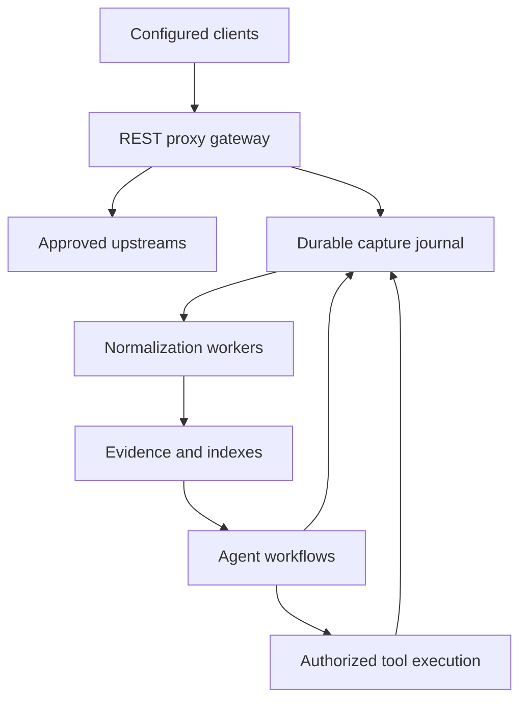

# REST proxy: durable knowledge gateway architecture study

Prepared October 7, 2026. Status: research-backed proposal, not an implementation or throughput certification.

## Decision in brief

Make REST proxy the logical gateway and owner of capture policy, event contracts, and evidence access. Keep transport forwarding, durable recording, indexing, and agent execution in separate modules/processes. Begin with configured HTTP upstreams and a local durable journal. Benchmark before selecting a distributed broker or Spark. Keep MIT during ownership/dependency review; consider AGPL plus commercial licensing for future rights-controlled releases.

This extends the project's coding-agent platform; it does not silently replace its current roadmap. Health, automotive, and fire-investigation applications are potential adapters, not validated products.

## 1. Verified baseline

Inspected public main at d2ae74c4adc6233981b16d38b26ae290e023a47b. No code changes, service execution, or performance tests were performed. Local deployed code and other branches may differ.

| Surface | Source evidence | Implication |
|---|---|---|
| Inference gateway | proxy/app.py; handlers_responses.py; openai_provider.py | Explicit model/chat/embedding endpoints; provider-specific behavior rather than arbitrary forwarding. |
| Context forwarding | proxy/context_forwarding.py | Opt-in, non-streaming/stateless path with loopback endpoint constraints and budget accounting. |
| Conversation persistence | handlers_chat.py; handlers_responses.py | Best-effort asyncio background persistence; not an acknowledged traffic journal. |
| FIRE recovery | memory/fire_store.py; tools/brain/context.py | Scoped SQLite snapshots, revision checks and retention exist. This is task recovery, not complete network-event replay. |
| Knowledge ingestion | scripts/index_workspace.py; tools/brain/docs/pipeline.py | Code/document ingestion can inform adapters, but arbitrary API payloads require new contracts. |
| License | LICENSE; pyproject.toml | MIT, with contributor copyright wording. Ownership has not been audited. |

No Spark/Kafka integration or SOCKS/CONNECT interception implementation was found in the searched Python and dependency surfaces. This is a bounded source finding, not a claim about every external deployment.

Pinned repository: https://github.com/Glassing-Wind/rest_proxy/tree/d2ae74c4adc6233981b16d38b26ae290e023a47b

## 2. Proposed boundaries

REST proxy remains the product entry point even if a mature transport engine is embedded or deployed behind it. A single logical gateway need not mean one process or one failure domain. Forwarding must not wait for embeddings, graph extraction, or LLM inference.

### Routing options

| Option | Value | Limitation | Proposed disposition |
|---|---|---|---|
| Configured HTTP reverse gateway | Client explicitly targets REST proxy; known upstream and visible application data | Requires client configuration and careful HTTP behavior preservation | First prototype |
| Explicit forward proxy | Supports clients configured with proxy settings | HTTPS CONNECT normally carries opaque TLS | Later compatibility track |
| Authorized TLS inspection | Accessible application payloads | Trust configuration, pinning and protocol limitations | Isolated optional experiment |
| Device tunnel | Broad routing coverage | OS-specific integration; routing alone does not reveal encrypted content | Separate future track |

Mitmproxy documents the distinction between CONNECT tunneling and trusted-certificate interception [1]. Reuse mature networking components where necessary rather than rebuilding every protocol in FastAPI. Do not present Shadowrocket itself as the capture/export backend without validating its integration interface.

Gateway acceptance must cover status codes, headers, binary bytes, compression, redirects, cancellations and streaming. Strip hop-by-hop headers correctly; never buffer unbounded bodies. Route to administrator-configured destinations, enforce egress restrictions, and validate redirects to avoid an open proxy or SSRF path.

## 3. Durable capture contract

Proposed baseline: append-only events, at-least-once processing, idempotent projections, bounded queues, and explicit capture receipts. Distinguish received, durably recorded, forwarded, completed and indexed states.

Two route policies are necessary:

- **Required capture:** commit an intent before forwarding. If the journal cannot accept it, reject before contacting upstream. Record completion separately. A crash after upstream execution can leave an unknown outcome; recording an intent cannot prevent that.
- **Best-effort capture:** prioritize forwarding, use a bounded spool, and expose capture gaps. Do not call this lossless.

For streaming responses, either durably append bounded chunks before acknowledging their capture or record metadata plus an explicitly partial artifact. An upstream response already delivered cannot be retroactively guaranteed captured. Power-loss durability depends on fsync, storage and database configuration; process-restart survival is a weaker claim.

Large bodies belong in a permission-controlled blob store with journal references. Publish a committed event only once its blob is durably available; reconcile orphan blobs and incomplete events after restart. Hashes demonstrate content identity, not authenticity or legal chain of custody.

### Storage candidates

| Candidate | Why consider it | Decision criterion |
|---|---|---|
| SQLite journal | Fits a native single-host prototype and existing FIRE usage | Explicit WAL/sync settings; measure writer contention and disk-full behavior |
| PostgreSQL event/outbox tables | Existing service profile; transactions can coordinate local records | Concurrent consumers, leases and backup/restore complexity |
| NATS JetStream | Persistent streams, durable consumers and replay [2] | Benchmark small distributed deployment and crash durability configuration |
| Apache Kafka | Partitioned retained log and independent consumers [3] | Large sustained traffic/backlogs justify operational footprint |

Recommended sequence: SQLite native adapter first; compare PostgreSQL for the existing service deployment; choose NATS or Kafka from measured requirements. Core NATS without JetStream does not satisfy durable replay [2]. Broker retention must preserve records long enough for rebuilds, not erase them merely because one consumer acknowledged them.

Do not promise end-to-end exactly-once delivery across arbitrary HTTP APIs. Commit projection writes and their event deduplication marker atomically where possible. Acknowledge only after that commit. For separate graph/vector stores, use versioned projection runs and a publication marker so readers do not silently mix versions.

### Replay modes

1. Projection replay: rebuild indexes from retained inputs; external calls disabled.
2. Historical workflow reconstruction: load recorded tool/model results and checkpoints.
3. New evaluation run: invoke models again under a new run ID; outputs may differ.
4. External action retry: explicit policy and idempotency support, never implied by replay.

## 4. Machine-readable contracts

Use JSON Schema and a CloudEvents-compatible envelope [4]. Select and pin a specification version before implementing. Event types might include http.request.accepted, http.response.completed, capture.incomplete, agent.task.created, tool.result.recorded and projection.published.

Required extensions: tenant/project/task/run IDs; correlation and causation IDs; authenticated producer identity; schema version; per-stream ordering key/sequence; source timestamp versus capture timestamp; payload reference and hash; retention/access labels; redaction policy version; parser/model version; replay provenance. These are proposed fields, not existing repository interfaces.

Separate commands requesting actions from events recording observations. Validate both at ingestion. Enforce authorization using server-side identity, not a caller-supplied tenant label. Give consumers read-only evidence references rather than duplicating sensitive payloads into every message.

Machine-readable agent communication is feasible. MCP provides a tools/resources interface [5]; A2A provides agent task/message/artifact interoperability [6]. Neither replaces our durable log. A2A explicitly distinguishes artifacts from messages and warns that critical messages cannot be assumed reliably delivered [6]. Persist necessary task changes independently.

## 5. LLM roles and orchestration

| Role | Work | Bounds |
|---|---|---|
| Coordinator | Break a user goal into tasks and select specialists | No implicit permission to execute side effects |
| Evidence worker | Retrieve, compare, and cite sources | Preserve scope and source freshness |
| Domain analyst | Interpret evidence and identify gaps | Mark hypotheses and uncertainty |
| Reviewer | Check claims against evidence and detect contradictions | Independent inputs where practical |
| Deterministic executor | Validate commands and call approved tools | Idempotency, audit and capability checks |

Use ordinary code for routing, authorization, arithmetic, validation and acknowledgments. Put LLMs downstream for semantic extraction and interpretation. Treat captured text as evidence, not privileged instructions. A reviewer agent is not a substitute for reliable source checks or expert review.

First measure one agent plus tools. Add specialists only when controlled evaluations justify added latency/cost. Record model identity, prompt/template versions, tool arguments/results, token use, budget limits and checkpoints; do not require hidden reasoning transcripts.

| Orchestration option | Fit | Initial position |
|---|---|---|
| Small durable state machine | Narrow ingest/review workflows | First prototype, with explicit transition tables |
| LangGraph library | Stateful agent graphs and checkpoint persistence [7] | First agent-framework candidate; evaluate concrete saver configuration |
| Temporal | Long-running operations and replay from workflow event history [8] | Candidate when operational recovery complexity warrants a service |

Do not combine every framework at launch. LangGraph checkpointing and Temporal histories solve different scopes; framework state is not our canonical evidence store. Crew/team-style frameworks remain unranked until tested against recovery, cancellation and structured output requirements.

Spark Structured Streaming is a downstream processing option, not the gateway or capture journal [9]. Add it when joins, windows, backfills or dataset size outperform simpler workers under controlled tests. Its guarantees depend on source/sink behavior; arbitrary external actions remain outside a blanket exactly-once claim.

## 6. Licensing and commercial model

Keep current MIT files/releases unchanged during this study. Previously granted MIT permissions remain available for those releases. Audit contributors, imported code, parser grammars, model weights, and distribution notices before future relicensing. No ownership conclusion is established here.

| Policy | Benefits | Limits |
|---|---|---|
| Continue MIT / consider Apache-2.0 for future controlled code | Low adoption friction; Apache has explicit patent provisions [10] | Competitors may keep derivatives proprietary |
| MPL-2.0 | File-level sharing for distributed covered changes; proprietary surrounding work possible [11] | Hosting alone generally does not trigger distribution obligations |
| AGPL-3.0 plus optional commercial terms | Stronger network copyleft; source access for remote users of modified covered programs [12] | Procurement friction; commercial exceptions need sufficient rights |

AGPL is not a ban on business use or a fee required from every profitable user. Open-source licenses must permit business use [13]. Paid alternative terms address obligations customers wish to avoid. Contribution agreements must explain relicensing rights clearly; a DCO alone is not automatically a blanket commercial relicensing grant. Seek counsel for the ownership inventory and actual license transition.

Initial upstream license observations: NATS server Apache-2.0 [14], LangGraph MIT [15], Temporal server MIT [16], mitmproxy MIT [17]. Apache Kafka/Spark are Apache projects; inspect exact release LICENSE/NOTICE and bundled components before shipping. These checks are not a transitive dependency clearance. Hosted platform terms, plugins and models can differ from core library licenses.

Revenue options compatible with openness: managed operation, private deployments, support, integration services and optional commercial licensing. Keep customer data rights and retention terms separate. Publicly accessible manuals, API responses and health data do not become redistributable simply because our code is open.

## 7. Phased implementation and acceptance

### Phase 0 — Contracts and baseline

Record upstream route policy, capture states, replay modes, event schema, supported body sizes and failure semantics. Freeze representative fixtures and collect direct-request versus gateway latency baselines. Audit current dependency licenses and contribution provenance. Exit: reviewed ADRs and reproducible fixtures; no license change.

### Phase 1 — Single-host durability proof

Implement one controlled JSON upstream, a SQLite journal, explicit capture policy, bounded body handling, one normalizer, and one replayable evidence projection. Keep inference routes intact and new behavior opt-in. Exit: all failure cases below pass; retrieval cites a captured source event.

### Phase 2 — Agent recovery

Add structured task contracts and one evidence agent. Reuse FIRE checkpoints where contracts align. Test resumption after prompt removal, cancellation, changed source, budget exhaustion and duplicate tool results. Exit: reproducible recovery and scoped access; no silent external retries.

### Phase 3 — Routing compatibility and scale decision

Add streaming and binary fixtures; then assess a mature forward-proxy adapter separately. Benchmark PostgreSQL, JetStream and Kafka only against measured load profiles. Report events/s, bytes/s, p50/p95/p99 latency, disk footprint, backlog drain and operator effort. Exit: selected backend with documented limits, backup/restore procedure and rollback.

### Phase 4 — Domain pilots

Health: an authorized API dataset and a cited personal timeline. Automotive: engine-specific procedures and parts fitment with manual provenance. Fire investigation: authorized historical evidence and expert review of hypothesis tables. Validate demand and accuracy separately; a working transport is not a validated domain product.

### Required failure tests

| Scenario | Acceptance |
|---|---|
| Crash after capture commit, before worker processing | Committed event recovered and projected |
| Worker crashes after write, before acknowledgment | Redelivery produces one logical projection |
| Gateway crashes after upstream action, before result capture | Unknown outcome visible; no blind resend |
| Disk full / journal unavailable | Required routes reject before forwarding; best-effort routes report gaps |
| Stream interrupted halfway | Partial capture and termination status preserved |
| Duplicate/out-of-order/schema-invalid events | Defined handling, no corrupt projection |
| Blob missing or hash mismatch | Quarantine with visible error |
| Tenant mismatch / secret-bearing headers | Access denied / secrets excluded from retained fixture |
| Graph succeeds, vector publication fails | Readers retain prior coherent version |
| Projection replay repeated twice | Same logical evidence; external action counter stays zero |
| Backup restored into fresh process | Declared retained events and checkpoints recover |

Process-kill tests do not establish power-failure or multi-host guarantees. Define those as later explicit gates. Capacity targets require an agreed workload; no throughput number is claimed in this report.

## 8. Immediate next implementation slice

Create a feature branch for the gateway/event contracts and local durability proof. Proposed modules: gateway routing/policy, capture journal/blob adapters, events schema, replay worker and projection interface. Names are provisional. Add crash-injection tests before wider routing. Keep licensing review a separate workstream.

Unresolved decisions: first upstream API; metadata versus full-body retention; required-capture route list; retention period; deployment profile; expected traffic/body distribution; acceptable latency overhead; contributor rights. These do not block drafting contracts but do affect deployment defaults.

## Primary sources

Sources checked October 7, 2026; upstream latest pages are mutable. Pin chosen component and protocol versions in implementation ADRs.

1. https://docs.mitmproxy.org/stable/concepts/how-mitmproxy-works/
2. https://docs.nats.io/concepts/jetstream
3. https://kafka.apache.org/41/design/design/ (versioned design reference, not latest-version selection)
4. https://cloudevents.io/
5. https://modelcontextprotocol.io/specification/2026-07-28
6. https://a2a-protocol.org/latest/specification/
7. https://docs.langchain.com/oss/python/langgraph/persistence
8. https://docs.temporal.io/workflow-execution
9. https://spark.apache.org/docs/latest/streaming/getting-started.html
10. https://www.apache.org/licenses/LICENSE-2.0.html
11. https://www.mozilla.org/en-US/MPL/2.0/FAQ/
12. https://www.gnu.org/licenses/license-recommendations.html (search retrieval; direct open failed)
13. https://opensource.org/osd
14. https://raw.githubusercontent.com/nats-io/nats-server/main/LICENSE
15. https://raw.githubusercontent.com/langchain-ai/langgraph/main/LICENSE
16. https://raw.githubusercontent.com/temporalio/temporal/main/LICENSE
17. https://github.com/mitmproxy/mitmproxy/blob/main/LICENSE
